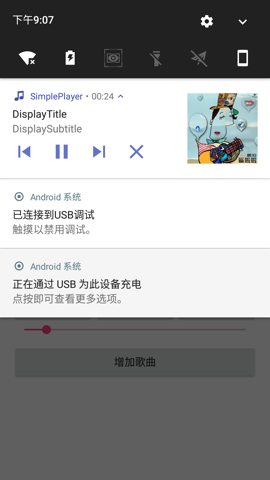
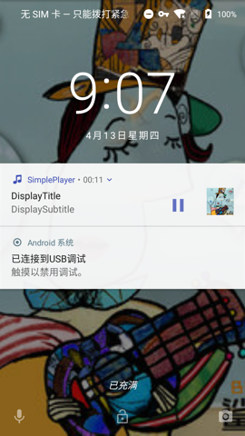

# SimplePlayer

SimplePlayer SDK是一个遵循谷歌MediaSession框架的SDK，在原生Android下表现不错，不确定在国产ROM的表现情况是否正常。
欢迎大家体验，提Issue

## 截图展示

   

## 功能
1. 播放本地和远端音乐
2. 通知栏控制
3. 音乐进度监听
4. 添加音乐进入队列
5. 专辑图片自定义
6. MediaSession状态监听
7. 音乐播放状态、总长度、SessionToken、URL获取
8. 是否继续播放下一首
9. 来电、来短信状态控制

## 使用

### 引入方式

coming soon...

### 用前准备
```
// 点击通知栏将进入的Activity
SimplePlayer.getInstance().setPlayingActivity(class);

// 是否连续播放
SimplePlayer.getInstance().setPlayContinuously(true);

// 注册媒体播放器控制回调
SimplePlayer.getInstance().registerMediaControllerCallback(MediaControllerCompat.Callback callback);

// 设置播放进度回调
SimplePlayer.getInstance().setOnProgressChangeListener(onProgressChangeListener);

// 设置小图标通知栏
SimplePlayer.getInstance().setSmallNotificationIcon(smallNotificationIcon);

// 设置默认歌曲图片资源
SimplePlayer.getInstance().setDefaultArtImgRes(defaultArtImgRes)

// 设置播放列表
SimplePlayer.getInstance().setMediaDataList(title, mediaDataList, initialMediaId);

// 向播放列表中添加播放项
SimplePlayer.getInstance().addMediaData(mediaData)
```

### 其他方法
```
// 获取音乐总长度
SimplePlayer.getInstance().getDuration();

// 获取当前播放的音乐URL
SimplePlayer.getInstance().getMediaUri();

// 获取当前播放的状态
SimplePlayer.getInstance().getState()
```

### 开始播放
```
// 获取控制器
SimplePlayer.getInstance().getTransportControls(MainActivity.this, new SimplePlayer.GetTransportControlsCallback() {
    @Override
    public void success(MediaControllerCompat.TransportControls transportControls) {
        if (transportControls != null)
            // do something
    }
    @Override
    public void error(String errorMsg) {

    }
});
```
| 操作 | 方法 |
| --- | --- |
|播放|play()|
|暂停|pause()|
|通过某个MediaId播放|playFromMediaId(mediaId, null)|
|滑动进度|seekTo(pos)|
|下一首|skipToNext()|
|上一首|skipToPrevious()|
|跳转到队列|skipToQueueItem(id)|
|停止播放|stop()|

### 善后说明
```
// 反注册媒体播放器控制回调
SimplePlayer.getInstance().unregisterMediaControllerCallback();

// 将进度监听器置为空
SimplePlayer.getInstance().setOnProgressChangeListener(null);
```

### 多媒体文件必填属性说明(具体属性见源码)

|属性名|描述|
|---|---|
|mediaId||
|mediaUri|多媒体文件路径（本地路径或远端URL）|
|title|多媒体标题(非显示用)|
|displayTitle|多媒体标题(显示在通知栏中)|
|displaySubtitle|多媒体副标题(显示在通知栏中)|
|artist|歌手|
|author|作者|